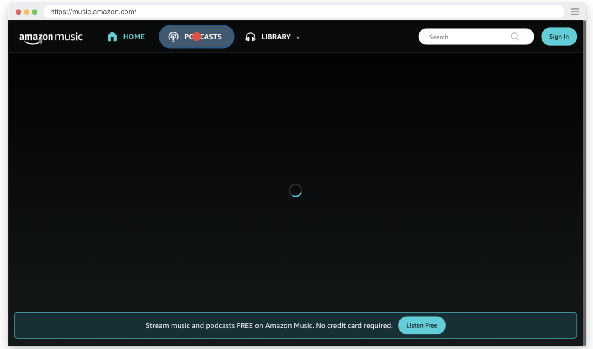
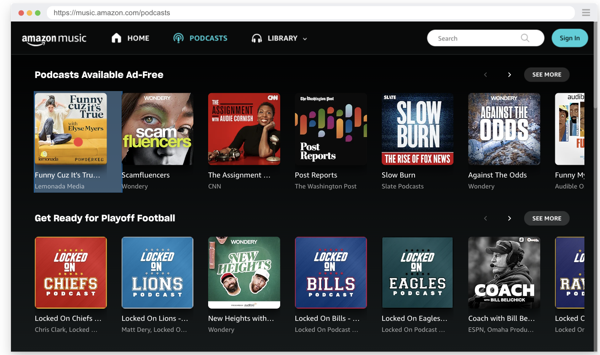
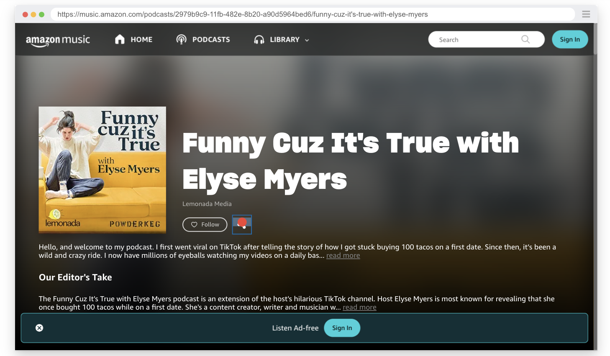
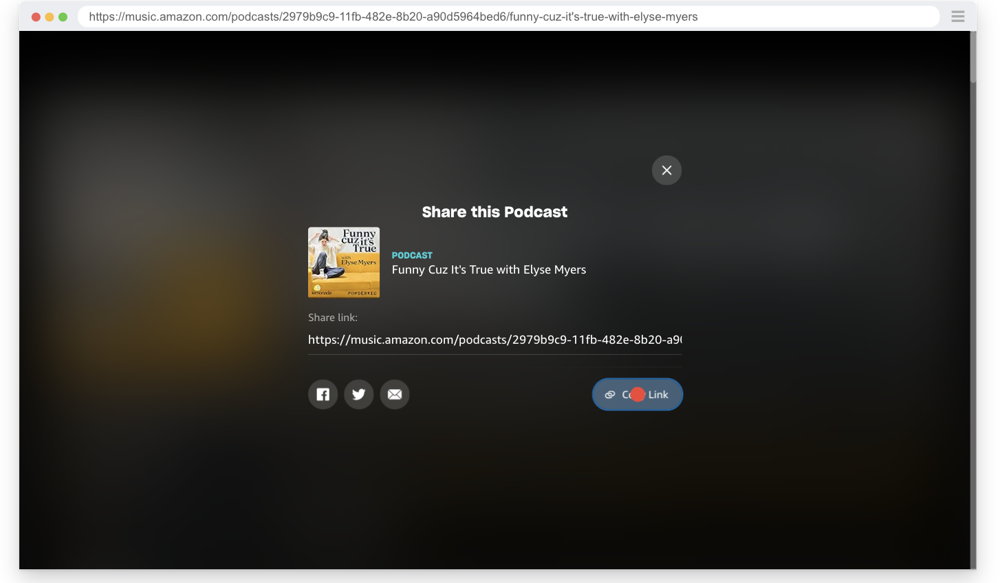

# Playwright Test Refactored Using Page Objects Model 

This repo contains a tests I previously wrote and wanted to use as practice in transferring into a test that utilizes the POM classes. With the help from my mentor and this video https://www.youtube.com/watch?v=rAec3mZFhF0&t=1582s

### Tech Stack 
- Javascript
- Node.js
- Playwright

### Files
- `originalPodcastTest.spec.js` is the original test. 
- `refactorPodcastTest.spec.js` is the refactored test.
- `pages` folder contains the POM classes.
- `2yearWarranty.spec.js` are also refactored tests, you can view the original repo containing them [here](https://github.com/MRJOHN5ON/SocialQAproject)
  

### Flow of the `Podcast` test:

1. Go to amazon music page. 
2. Click on the podcast section. 
3. Click on the first podcast.
4. Click on the share button. 
5. Read the share link shown the text field.
6. Click the copy button which automatically adds the link to the clipboard.
7. Compare the link in the clipboard with the link shown in the text field and assert that they are the same.

#### Screenshots for visual reference:

- `page.getByRole('link', { name: 'Podcasts' })`

- `page.locator('music-vertical-item').first()` 
- `page.getByTestId('detailHeaderButton2')`
- `page.getByTestId("dialog").locator("input")`
- `page.locator('music-button').filter({ hasText: 'Copy link' }).getByRole('button')`

### Flow of the `2 Year Warranty Test`
1. Navigate to the product page
2. Add the product to the cart
3. Verify the 2-year warranty checkbox is visible and select it
4. Confirm the warranty checkbox is checked
5. Ensure the "Add Protection" button is visible and click it
6. Verify the success message is displayed
7. Check the cart item count is visible and matches the expected count
8. View the cart and verify the item subtotal is correct
9. Proceed to checkout and confirm the URL redirects to the sign-in page
#### Video for visual reference:
[Watch the video on YouTube](https://www.youtube.com/watch?v=0s31v-AiT58)

# Important notes:
- I used the `page.getByTestId` method to locate some elements.
- `testIdAttribute: 'id'` is added in the `playwright.config.js file.`
- DUE TO AMAZON'S ANTI BOT DETECTION, THIS PROJECT TYPICALLY FAILS IN CI :(
